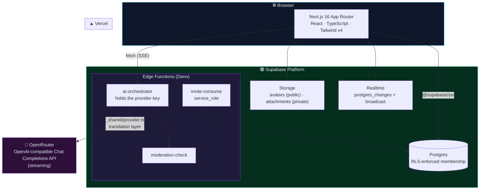
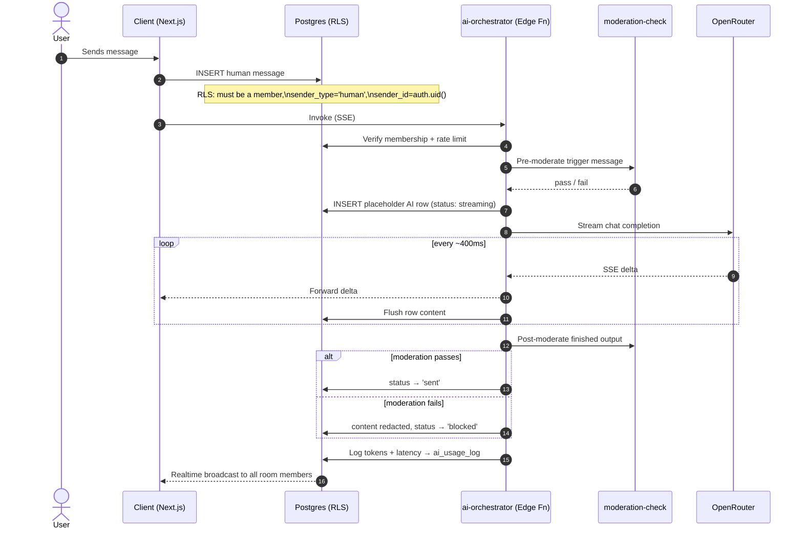
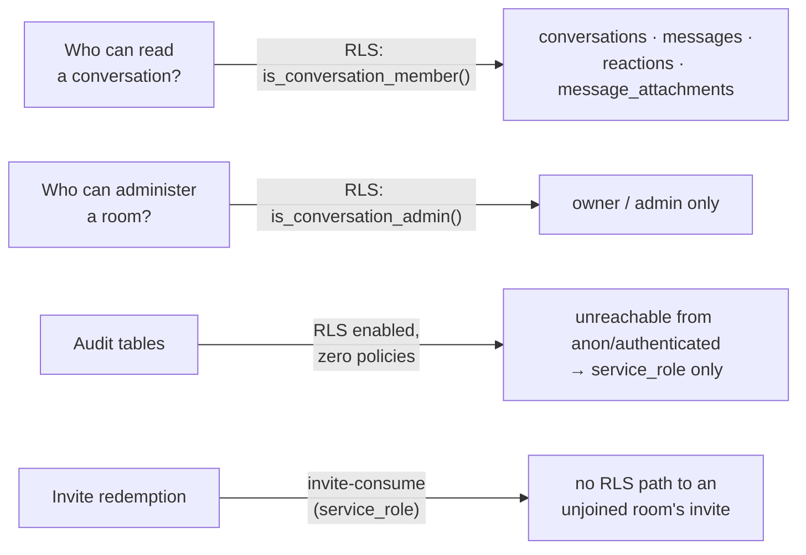
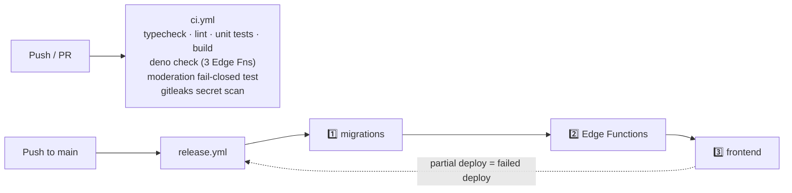

<div align="center">

```
   ██████╗ ██████╗ ███╗   ██╗███████╗██╗     ██╗   ██╗███████╗███╗   ██╗ ██████╗███████╗
  ██╔════╝██╔═══██╗████╗  ██║██╔════╝██║     ██║   ██║██╔════╝████╗  ██║██╔════╝██╔════╝
  ██║     ██║   ██║██╔██╗ ██║█████╗  ██║     ██║   ██║█████╗  ██╔██╗ ██║██║     █████╗
  ██║     ██║   ██║██║╚██╗██║██╔══╝  ██║     ██║   ██║██╔══╝  ██║╚██╗██║██║     ██╔══╝
  ╚██████╗╚██████╔╝██║ ╚████║██║     ███████╗╚██████╔╝███████╗██║ ╚████║╚██████╗███████╗
   ╚═════╝ ╚═════╝ ╚═╝  ╚═══╝╚═╝     ╚══════╝ ╚═════╝ ╚══════╝╚═╝  ╚═══╝ ╚═════╝╚══════╝
```

### The AI Chat Platform — Where 1:1 Conversations Meet Group Intelligence

**A ChatGPT × Discord hybrid.** Private 1:1 AI chat and opt-in AI participation inside multi-user rooms — one conversation model, two experiences.

<br/>


[](https://github.com/Rahulbharvadiya/Group-Chatbot/stargazers)
[](https://github.com/Rahulbharvadiya/Group-Chatbot/commits/main)

<br/>

**[🚀 Quick Start](#-quick-start) · [🏗 Architecture](#-architecture) · [🔐 Security](#-security-model) · [🎬 Motion System](#-motion-system) · [📄 Pages](#-page-inventory) · [📊 By the Numbers](#-by-the-numbers) · [🆚 How It's Different](#-how-its-different) · [🧪 CI/CD](#-cicd--push-everything-release-policy) · [❓ FAQ](#-faq)**

</div>

<br/>

```
╔══════════════════════════════════════════════════════════════════════╗
║   No env vars? No problem. ONYX boots straight into DEMO MODE        ║
║   — a fully seeded, in-browser experience. Every screen, every       ║
║   animation, every streaming reply — explorable with zero backend.   ║
╚══════════════════════════════════════════════════════════════════════╝
```

---

## 📊 By the Numbers

<div align="center">

| 🧩 Edge Functions | 🧪 E2E Tests | 🎨 Contrast Pairs Verified | ⏱ Rate-Limit Triggers | 📄 App Routes | 🌗 Themes |
|:---:|:---:|:---:|:---:|:---:|:---:|
| **3** | **31** | **54** | **BEFORE INSERT ×2** | **10** | **light / dark / system** |

| ⚡ Streaming Flush | 🚦 AI Call Ceiling | 🛡 Moderation Stages | 🔑 Keys in Browser | 🕵️ Audit Table Policies |
|:---:|:---:|:---:|:---:|:---:|
| **~400ms** | **10 calls/min** | **2 (pre + post)** | **0** | **0 (service_role only)** |

</div>

These aren't aspirational — every number above is pulled straight from the schema, the Edge Functions, and the test suites already committed in this repo (see [Security Model](#-security-model) and [CI/CD](#-cicd--push-everything-release-policy) for the source of each).

---

## 🆚 How It's Different

Most "AI + chat" projects pick a lane: either a private assistant thread, or a bot bolted onto an existing group-chat app. ONYX treats both as the *same primitive*.

| | Typical AI chat app | Typical group chat app | **ONYX** |
|---|:---:|:---:|:---:|
| 1:1 AI conversation | ✅ | ❌ | ✅ |
| Multi-user rooms | ❌ | ✅ | ✅ |
| AI as an opt-in room participant, not a bolted-on bot | ❌ | ⚠️ plugin-style | ✅ native |
| Every member sees the *same* streamed tokens land live | — | ❌ (bots usually post once, finished) | ✅ |
| Provider key ever touches the browser | ⚠️ varies | — | ❌ never |
| Explorable with zero backend | ❌ | ❌ | ✅ full demo mode |
| Moderation fails **closed** on classifier error | ⚠️ varies | ⚠️ varies | ✅ |
| Row-Level Security on every table | ⚠️ varies | ⚠️ varies | ✅ |

> The unifying idea: a `conversations` row doesn't care whether it has 2 members or 20, and a `messages` row doesn't care whether its author is a human or the AI. Everything downstream — RLS, streaming, moderation, realtime — inherits from that one decision.

---

## ✨ Why ONYX

| | |
|---|---|
| 💬 **Unified conversation model** | 1:1 chats and group rooms share the same schema — the AI is just another participant |
| ⚡ **True shared streaming** | One `messages` row updates in place — every member of a room watches the *same* tokens land at the *same* moment |
| 🔒 **Key never leaves the server** | The OpenRouter provider key lives only in an Edge Function's environment — the browser never sees it |
| 🛡 **Fail-closed moderation** | Two-stage (pre + post) checks; a classifier *error* blocks publication rather than silently passing it |
| 🎛 **Row-Level Security everywhere** | Every table's access rule is a Postgres policy, not app-layer trust |
| 🎨 **A real motion system** | Every animation traces back to one token file — nothing ad hoc, nothing per-component |
| 🧪 **Demo-first** | The entire product is explorable without ever touching a database |

---

## 🚀 Quick Start

```bash
npm install
npm run dev          # → http://localhost:3000
```

With no environment variables set, the app boots into **demo mode** — an in-browser store with seeded conversations and a locally simulated streaming assistant.

<details>
<summary><b>🔌 Connecting a real Supabase project</b></summary>

<br/>

1. Create a project at [supabase.com](https://supabase.com)
2. Run [`supabase_schema.sql`](./supabase_schema.sql) in the SQL Editor (or `supabase db push`)
3. Dashboard → **Authentication** → enable **Email** and **Google** providers
4. Set the frontend keys:

   ```bash
   cp .env.example .env.local
   # fill in NEXT_PUBLIC_SUPABASE_URL and NEXT_PUBLIC_SUPABASE_ANON_KEY
   ```

5. Set the server-only secrets and deploy the functions:

   ```bash
   supabase secrets set OPENROUTER_API_KEY=sk-or-...
   supabase functions deploy ai-orchestrator moderation-check invite-consume
   ```

6. **Confirm RLS is ON** for every table (shield icon in the Table Editor) before going to production.

</details>

---

## 🏗 Architecture



> **The AI provider key never reaches the browser.** The client calls `ai-orchestrator`, which streams SSE back while progressively updating one `messages` row — so every member of a group room watches the same answer appear at the same moment.

### 🔄 Streaming lifecycle (data flow)



`regenerate()` reruns from step 3 onward with `supersedes_id` set — the previous answer becomes `status: 'superseded'` and drops out of the view **without being destroyed.**

---

## 🔐 Security Model



| Concern | Enforcement |
|---|---|
| 📖 Who can read a conversation | RLS `is_conversation_member()` on `conversations`, `messages`, `reactions`, `message_attachments` |
| 👑 Who can administer a room | RLS `is_conversation_admin()` — owner/admin only |
| 🕵️ Audit tables | RLS **enabled with zero policies** → unreachable from `anon`/`authenticated`; only `service_role` |
| 🔑 AI provider key | `OPENROUTER_API_KEY` — only ever in the Edge Function environment |
| 🎟 Invite redemption | `invite-consume` (service_role) — the client has no RLS path to an invite for a room it hasn't joined |
| 🚧 Moderation | Two stages (`pre`, `post`), **fails closed** — a classifier error blocks publication |
| ⏱ Rate limiting | 30 msg/min & 20 invites/hr as `BEFORE INSERT` triggers (every write path), plus fixed-window Edge Function counters — 10 AI calls/min, 60 moderation checks/min |
| 📎 Attachments | Private bucket, storage policies call the same membership check |
| 🧠 Training data | `profiles.training_opt_in`, off by default; routing requires **unanimous** opt-in |
| ↪️ Redirect targets | `?next=` collapsed to a same-origin path by `safeInternalPath()` — no open redirects |

> ⚠️ The client-side classifier in `src/lib/data/moderation-local.ts` is a **UX affordance only** — it warns before you send. The authoritative check always runs server-side.

---

## 🎨 Typography <sub>§2.3</sub>

Inter and JetBrains Mono are **self-hosted** — variable `.woff2` files live in [`src/app/fonts/`](./src/app/fonts) (SIL OFL 1.1 licences committed alongside them), wired through `next/font/local`, which derives adjusted fallback metrics so the system-font fallback doesn't shift layout on first paint. **No request ever leaves for a font CDN.**

---

## 🎬 Motion System <sub>§2.7</sub>

Every animation is driven by tokens in [`src/lib/motion.ts`](./src/lib/motion.ts) — no ad hoc per-component timings.

<table>
<tr><td>

**Durations**
- `120ms` micro
- `200ms` standard
- `320ms` emphasis
- `480ms` hero

</td><td>

**Easing**
- Entering → `cubic-bezier(0.16, 1, 0.3, 1)`
- Exiting → `cubic-bezier(0.7, 0, 0.84, 0)`

</td><td>

**Rules**
- Transform / opacity **only** — never `width`/`height`/`top`/`left`
- Exit is **always** faster than entry

</td></tr>
</table>

`prefers-reduced-motion` collapses every animation to an **instant cut** (not a slower version) via a global override in `globals.css`.

**Highlights:**

- 🌀 Staggered scroll reveals on the landing page + hero parallax
- 🪟 Blurred-glass nav after 40px scroll
- 📋 `layout` animation for conversation-list reordering
- ⌨️ Streaming reveal with a blinking caret — *no per-token effects* (visually noisy at speed)
- 💬 Staggered-pulse typing dots
- 🎉 Reactions pop in on an overshoot spring
- 🌗 Sun ↔ moon rotate-and-fade theme morph with a 200ms surface crossfade
- 💀 Skeleton shimmer wherever content has a predictable shape (spinners only where it doesn't)
- 🔔 Toasts with a visible shrinking dismissal bar
- 📡 Accessible offline / reconnecting / restored banner — collapses to an instant cut under `prefers-reduced-motion`

> 🛑 **Destructive confirms** use a debounce with a visual tell — clicking confirm within **450ms** of the dialog opening *shakes it* instead of silently swallowing the click.

---

## 📄 Page Inventory

| Route | Purpose |
|---|---|
| `/` | Landing — hero with a live animated demo, features, how-it-works, security, pricing teaser |
| `/pricing` | Standalone pricing — full plan table, FAQ, limits behind each tier |
| `/login`, `/signup` | Email + Google auth, inline validation, password strength, in-place success states |
| `/forgot-password`, `/reset-password` | Recovery flow |
| `/auth/callback` | OAuth / magic-link code exchange |
| `/onboarding` | 3-step: profile & training opt-in → theme → first conversation |
| `/app` | Dashboard — greeting, quick actions, starter prompts |
| `/app/c/[id]` | Chat surface — 1:1 and group, streaming, reactions, edit, regenerate |
| `/app/settings` | Profile, appearance, privacy & data (incl. JSON export), account |
| `/join/[code]` | Invite redemption |

> Room settings (name, topic, AI mode, members, roles, invites, danger zone) live in a modal on the chat surface.

---

## 🗂 Project Layout

```
src/
├── app/                      routes (App Router)
├── components/
│   ├── ui/                   button, input, modal, toast, avatar, skeleton
│   ├── chat/                 chat-view, composer, message-item, markdown, room-settings
│   ├── layout/                sidebar, search / join / new-conversation modals
│   ├── landing/               nav, hero-demo, section primitives
│   ├── theme-provider.tsx     light/dark/system + morphing toggle
│   ├── session-provider.tsx   auth state, works in both modes
│   └── network-provider.tsx   online/offline/reconnecting state (§27)
├── app/fonts/                self-hosted Inter + JetBrains Mono (OFL licences)
└── lib/
    ├── motion.ts              §2.7 motion tokens — single source of truth
    ├── data/api.ts            unified data layer (Supabase ⟷ demo)
    ├── data/demo-store.ts     in-browser Supabase stand-in
    └── supabase/              browser + server clients

supabase/
├── functions/
│   ├── ai-orchestrator
│   ├── moderation-check
│   ├── invite-consume
│   └── _shared/provider.ts    pure OpenRouter translation layer — unit-tested
└── migrations/                versioned history — `supabase db push` applies these

supabase_schema.sql            complete, re-runnable snapshot of the database layer
```

---

## 🧪 CI/CD — "push everything" release policy <sub>§1</sub>



- **[`.github/workflows/ci.yml`](./.github/workflows/ci.yml)** — ✅ live
- **[`.github/workflows/release.yml`](./.github/workflows/release.yml)** — ✅ live, strict dependency order: **migrations → Edge Functions → frontend**

> ⚠️ **The Playwright `e2e` job and the token-contrast step are NOT in `ci.yml` yet.** The `e2e/` suite (31 tests) and `scripts/contrast.mjs` are committed and run locally, but the commit that adds them to `ci.yml` can't be pushed by the agent's GitHub App credential (GitHub rejects workflow writes server-side without the `workflows` permission — re-verified 2026-08-28). The diff ships as [`ci/patches/ci-playwright-and-contrast.patch`](./ci/patches/ci-playwright-and-contrast.patch) — see [`RELEASING.md` §3](./RELEASING.md) for the one-time owner action.

Both workflows were initially shipped under [`ci/`](./ci) (the original push credential lacked the `workflows` permission) and activated into `.github/workflows/` once resolved. They now live **only** there — [`ci/README.md`](./ci/README.md) documents jobs, the Deno configuration contract, and required secrets.

Edge Function type-checking uses two synchronized Deno configs — root [`deno.json`](./deno.json) (CI, provisions npm deps from [`deno.lock`](./deno.lock)) and [`supabase/functions/deno.json`](./supabase/functions/deno.json) (Supabase CLI bundling). Their `imports` must stay identical.

**Audit & release docs:**

| Doc | Covers |
|---|---|
| [`SECURITY.md`](./SECURITY.md) | Secrets, RLS/authorization, XSS handling, fail-closed moderation, unanimous training consent, owner/config follow-ups |
| [`AUDIT.md`](./AUDIT.md) | Verifiable security / performance / accessibility audit — measurable numbers, nothing fabricated |
| [`RELEASING.md`](./RELEASING.md) | Owner-run release checklist — server secrets, CI activation + action bumps, release secrets, db push + function deploy, verification |

---

## 📜 Scripts

```bash
npm run dev             # dev server
npm run build           # production build
npm run start            # serve the build
npm run lint             # eslint
npx tsc --noEmit          # typecheck
npm test                 # unit + component + a11y (axe-core) suites
npm run test:a11y        # vitest axe-core accessibility suite (jsdom, structural)
npm run test:edge        # Deno moderation fail-closed integration test (needs Deno runtime)
npm run test:contrast    # WCAG AA token contrast against globals.css (no browser)
npm run test:e2e         # Playwright E2E + browser axe audit (needs Chromium)
npm run test:e2e:install # download Chromium for the E2E suite
```

### 🖥 End-to-end / browser accessibility

The Playwright suite (`e2e/`) runs the app in **demo mode** and covers the critical journeys: AI chat streaming + persistence, group rooms, `@ai` mention and moderation, ⌘K command palette, history, and a real-browser **axe-core audit (light + dark, WCAG AA — not disabled)**. It targets stable selectors (roles, labels, `data-testid`), emulates `prefers-reduced-motion`, and produces a report + traces on failure.

```bash
npx playwright install --with-deps chromium  # one-time
npm run test:e2e
```

The token contrast script parses `src/app/globals.css`, resolves the semantic tokens for both themes, and asserts every text-on-surface pair meets **4.5:1 (normal) / 3:1 (large & UI)** — 54 pairs, both themes. Runnable locally today (`npm run test:contrast`); CI wiring is part of `ci/patches/ci-playwright-and-contrast.patch`.

---

## ❓ FAQ

<details>
<summary><b>Do I need a Supabase project just to try it out?</b></summary>
<br/>
No. Running <code>npm install && npm run dev</code> with no environment variables boots the app straight into demo mode — a fully seeded, in-browser experience with a locally simulated streaming assistant. Every screen and animation is explorable with zero backend.
</details>

<details>
<summary><b>Can the browser ever see the OpenRouter API key?</b></summary>
<br/>
No — by design. <code>OPENROUTER_API_KEY</code> lives only in the <code>ai-orchestrator</code> Edge Function's environment. The client calls the function over SSE and never receives, stores, or has any code path that could leak the raw key.
</details>

<details>
<summary><b>What happens if the moderation classifier itself errors out?</b></summary>
<br/>
Publication is blocked. Moderation in ONYX is fail-closed, not fail-open — an infrastructure error in the classifier is treated the same as a failed check, not treated as a pass.
</details>

<details>
<summary><b>Why aren't the Playwright and contrast checks running in CI yet?</b></summary>
<br/>
They're fully written and pass locally (31 E2E tests, 54 contrast pairs), but the commit that wires them into <code>ci.yml</code> requires GitHub's <code>workflows</code> permission, which the automated push credential used during development doesn't have. The diff is committed as a ready-to-apply patch — see <a href="#-cicd--push-everything-release-policy">CI/CD</a> for the one-line owner action that activates it.
</details>

<details>
<summary><b>Is this production-ready?</b></summary>
<br/>
The security model (RLS on every table, server-only keys, fail-closed moderation, rate limiting) and CI/release pipeline are built for production use — see <code>SECURITY.md</code>, <code>AUDIT.md</code>, and <code>RELEASING.md</code> for the exact checklist an owner runs before flipping the switch.
</details>

---

<div align="center">

### Built with Next.js 16 · Supabase · OpenRouter

<sub>Demo mode: zero backend required · Production mode: RLS on every table, key on the server, moderation fails closed</sub>

</div>

Deployed at: https://group-chatbot.onrender.com/
